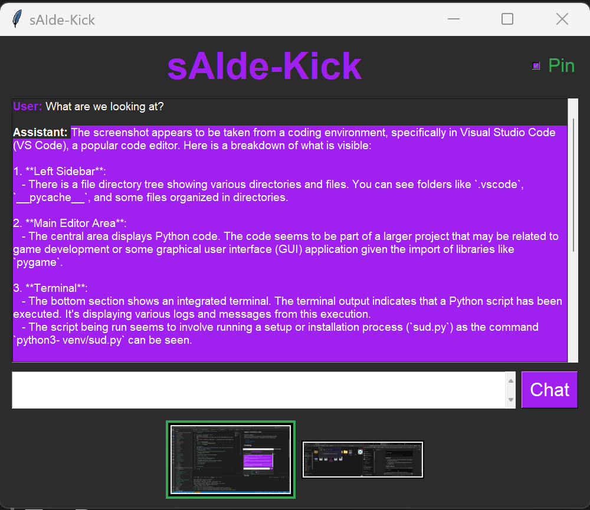

# sAIde-Kick
A vision LLM desktop assistant widget by @Zlata_Salyukova  
### Free for use to anyone! Please credit me though.
Any help finding job in the AI space is greatly appreciated! ^-^ Thank you!  

## Socials:
> Follow - [X / Twitter @Zlata_Salyukova](https://x.com/Zlata_Salyukova)  
> Email - zlata.salyukova@gmail.com

## Support / Instructions / Links:
Multi-Monitor selection!  + Chat history context!  
Made for use with Windows, but should work on other Operating Systems (Linux/Mac)  
| GPT-4o API | Claude 3.5 coming soon... | Local Open-source vision model? not yet. |    
- [Install](#Installing)  
- [Images / Instructions](#Instructions)  
- [Features](#Features)
- [To-Do / WIP](#To-Do)

# Installing
### Windows instructions, but should work with Linux and Mac with alternative appropriate terminal commands:  
1. Clone this repo:  
`git clone https://github.com/Zlata-Salyukova/sAIde-kick.git` 
2. Navigate into directory:  
`cd .\sAIde-kick`
3. Create and activate virtual environment:  
`python -m venv .venv`  
`.venv\Scripts\activate`  
4. Install python pip requirements.txt:  
`pip install -r requirements.txt`  
5. Add OpenAI API key to system environment variables:  
`set OPENAI_API_KEY=sk-your_api_key_here`  
6. Run sAIde-Kick!  
`python main.py`  

# Instructions  
Here is what you will see when the app opens:  
  
- Top (Pin Checkbox): On by default. Will pin the widget above any other window on your PC.  
- Middle (Chat box): Shows your chat history between you and the assistant.  
- Below chat area (Text input and chat button): Type and send chats to the assistant.  
- Bottom (Monitor Preview / Selection): Select which monitor you want to send to the assistant for context. Will highlight in green, supports selection of multiple monitors to send for context.

# Features
- ChatGPT 4o API
- Pin window
- Chat history context
- Multi-monitor support/selection

# To-Do
- [x] Release initial code for sAIde-Kick! 7-8-24
- [ ] Clear chat history button.
- [ ] Implement Claude 3.5 Sonnet API.
- [ ] Selection box for which model to use.
- [ ] Local chat history storage.
 